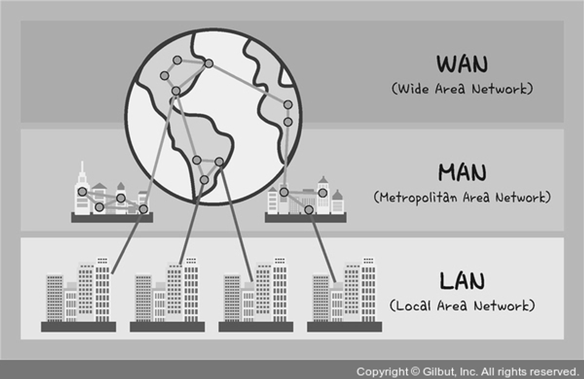

## 👩‍🚀 네트워크 분류

```
🌝 규모를 기반으로 네트워크를 분류해봅시다!
```



### 🚀 LAN (Local Area Network)

- 근거리 통신망
- 사무실과 개인적으로 소유 가능한 규모, 같은 건물이나 캠퍼스 같은 좁은 공간에서 운영된다.
- 전송 속도는 빠름
- 혼잡하지 않다.

### 🚀 MAN (Metropolitan Area Network)

- 대도시 지역 네트워크
- 서울시처럼 도시 같은 넓은 지역에서 운영된다.
- 전송 속도는 평균
- LAN보다 많이 혼잡하다.

### 🚀 WAN (Wide Area Network)

- 광역 네트워크
- 국가, 대륙 같은 더 넓은 지역에서 운영된다.
- 전송 속도는 낮음
- MAN보다 더 혼잡하다.
