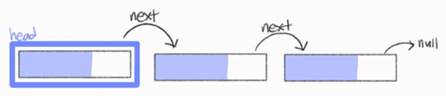
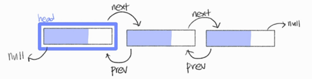
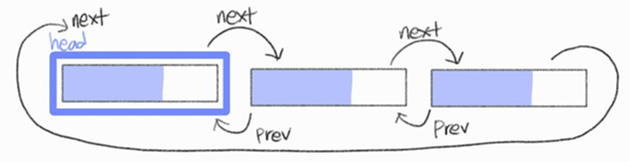

## 🧙‍♀️ 연결 리스트

- 데이터를 감싼 노드를 포인터로 연결해서 공간적인 효율성을 극대화시킨 자료 구조
- prev 포인터와 next 포인터로 앞과 뒤의 노드를 연결시킨 것
- 맨 앞에 있는 노드를 `head`라고 한다.
- 시간 복잡도
  |삽입|삭제|탐색|
  |:--:|:--:|:--:|
  |O(1)|O(1)|O(n)|

### 🪄 싱글 연결 리스트

- next 포인터만 가진다.

### 🪄 이중 연결 리스트

- next 포인터와 prev 포인터를 가진다.
- 코드로 구현할 경우 앞에서부터 요소를 넣는 함수, 뒤에서부터 요소를 넣는 함수, 중간에 요소를 넣는 함수 등을 가질 수 있다.

### 🪄 원형 이중 연결 리스트

- 이중 연결 리스트와 같지만 마지막 노드의 next 포인터가 헤드 노드를 가리킨다.
