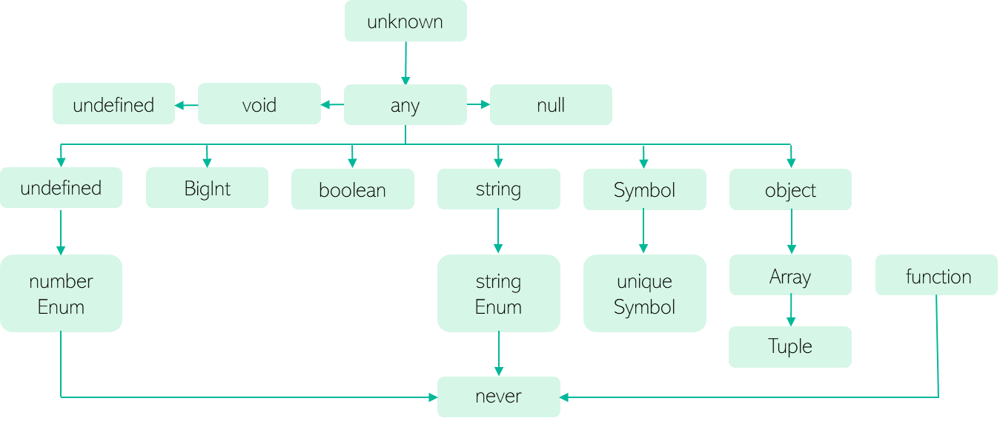

## 🌝 타입스크립트만의 독자적 타입 시스템

- JS의 슈퍼셋으로 TS가 등장하면서 JS 자료형으로 표현할 수단과 필요성이 없던 독자적 타입 시스템을 가지기 시작했다.
  - 그럼에도 TS의 타입 시스템이 내포하는 개념은 모두 JS에서 기인한 것이다.

> TS의 타입 계층 구조



### 🌒 `any` 타입

- JS에 존재하는 모든 값을 오류 없이 받을 수 있는 타입
- 타입을 명시하지 않은 것과 동일한 효과를 나타낸다.

```ts
// 이러한 상황에서도 에러가 발생하지 않는다
let state: any;

state.foo.bar = () => console.log("anyany");
```

> ⚠️ `any` 타입 사용은 지양하는 것이 좋다!

- TS의 정적 타이핑을 무색하게 만들고 JS의 동적 타이핑으로 돌아가는 결과를 가져올 수 있다.
- TS의 타입 검사를 무시하고 잠재적으로 위험한 상황을 초래할 가능성이 커진다.
- 실수 또는 악의적으로 다른 값을 넘기더라도 에러로 간주하지 않아 컴파일러에서는 에러가 도출되지 않다가 런타임에서 심각한 오류가 발생할 수 있다.
- `tsconfig.json` 파일에서 `noImplicitAny` 옵션 활성화하기
  - 이를 통해 타입이 명시되지 않은 변수의 암묵적인 `any` 타입에 대한 경고를 발생시킨다.

```
👩‍🏫 그렇다면 어떤 상황에서 any 타입을 사용해야만 할까요?
```

> 1️⃣ 개발 단계에서 임시로 값을 지정해야 할 때

- 복잡한 구성 요소의 값이 중간에 변경될 가능성이 있거나 아직 세부 항목의 타입이 확정되지 않은 경우
- 타입을 세세하게 명시할 때 소요되는 시간을 절약한 뒤 세부 스펙이 나오는 시점에 다른 타입으로 대체하려는 경우

> 2️⃣ 어떤 값을 받아올지 또는 넘겨줄지 정할 수 없을 때

- API 요청 및 응답 처리
- 콜백 함수 전달
- 타입이 잘 정제되지 않아 어떤 인자를 주고받을지 특정하기 힘든 외부 라이브러리 사용
- 다양한 범주에 따라 인자의 개수나 타입을 일일이 명시하기 힘든 경우

➡️ JS 입장에서 어떤 값의 타입을 명확하게 지정하기 어려운 경우

> 3️⃣ 값을 예측할 수 없을 때

- `Fetch API`

  - 외부 라이브러리나 웹 API의 요청에 따라 다양한 값을 반환한다.
  - 요청 이후의 응답을 특정 포맷으로 파싱하는 일부 메서드의 경우 반환 타입이 `any`로 매핑되어 있다.

  ```ts
  const load = async () => {
    const res = await fetch("...url");
    const data = await res.json(); // type: Promise<any>
    return data;
  };
  ```

### 🌓 `unknown` 타입

- 무엇이 할당될지 아직 모르는 상태의 타입
- TS 3.0에서 기존 타입 시스템을 보완하기 위해 추가되었다.

> 🤔 `any`와는 어떤 차이가 있을까?

| `any`                                                            | `unknown`                                     |
| :--------------------------------------------------------------- | :-------------------------------------------- |
| 어떤 타입이든 `any` 타입에 할당 가능하다.                        | 어떤 타입이든 `unknown` 타입에 할당 가능하다. |
| `any` 타입은 어떤 타입으로도 할당 가능하다. <br/> (`never` 제외) | `any` 외의 다른 타입에는 할당 불가능하다.     |

```ts
let unknownVal: unknown = "";

let some1: any = unknownVal; // ok. any에는 할당 가능
let some2: number = unknownVal; // error
```

> 🤔 `unknown`, 왜 등장한 타입일까?

- `unknown`으로 선언된 변수에는 어떤 타입이 할당되었는지 알 수 없으므로 값을 가져오거나 내부 속성에 접근할 수 없다.

  - 객체 내부에 접근하는 모든 시도에서 에러가 발생한다.
  - 함수, 객체의 속성 접근, 클래스 생성자 호출을 통한 인스턴스 생성 등

  ```ts
  // 할당 시에는 에러가 발생하지 않는다.
  const unknownFunc: unknown = () => console.log("unknown");

  // 실행 시 에러가 발생한다.
  unknownFunc(); // 🚨 Error: Object is of type 'unknown'.ts
  ```

  ➡️ `unknown` 타입으로 할당된 변수는 어떤 값이든 올 수 있음을 나타내는 동시에 엄격한 타입 검사를 강제한다.

- `any` 사용으로 발생 가능한 문제점들을 보완하기 위해 등장했다.
  - 할당될 값을 파악하기 어려울 때 `any`를 사용해 회피한 경우 수정을 누락하면 예상치 못한 버그가 생길 수 있다.
  - `unknown`은 타입 검사를 강제하고 타입이 식별된 후에 사용할 수 있게 한다.

### 🌔 `void` 타입

- JS에서는 함수가 명시적인 반환문을 작성하지 않을 때 `undefined`를 반환한다.
- TS에서 함수가 어떤 값을 반환하지 않는 경우 `void`를 사용한다.

  ```ts
  const someFunc = (message: string): void => {
    console.log(message);
  };
  ```

- 변수에도 할당할 수 있지만 함수가 아닌 값에 대해서는 대부분 무의미하다.
  - `undefined` 또는 `null` 값만 할당할 수 있다.
  - `tsconfig.json`에서 `strictNullChecks` 옵션을 설정했거나 컴파일 시 해당 플래그 설정이 실행된다면 `null` 값 할당이 불가능하다.
  - 가독성 측면에서도 `undefined` 또는 `null` 키워드를 직접 명시하는 것이 바람직하다.

```
👩‍🏫
TS 컴파일러가 내부에 별도의 반환문이 없는 함수의 타입을 void로 추론해주기 때문에
일반적으로 함수 자체를 다른 함수의 인자로 전달하는 경우에만 void를 응시합니다.
```

### 🌖 `never` 타입

- 값을 반환할 수 **없는** 타입
  - 값을 반환하지 **않는** 것과 다르다.

```
👩‍🏫 JS에서 값을 반환할 수 없는 경우에는 어떤 것들이 있을까요?
```

> 에러를 던지는 경우

- 런타임에 의도적으로 에러를 발생시키고 catch하는 경우

```js
const createError = (res: Response): never => {
  // throw로 에러를 발생시킨 경우 값을 반환하는 것으로 간주하지 않는다.
  throw new Error(res.getMessage());
};
```

➡️ 특정 함수가 실행 중 마지막에 에러를 던지는 작업을 수행한다면 해당 변수의 return type은 `never`

> 무한히 함수가 실행되는 경우

- 함수 내에서 무한 루프를 실행하는 경우 (함수가 종료되지 않아 값을 반환하지 못하는 경우)

```js
const infiniteFunc = (): never => {
  while (true) {
    //
  }
};
```

<hr/>

- 모든 타입의 하위 타입이다.
  - 자신을 제외한 어떤 타입도 `never` 타입에 할당될 수 없다. (`any` 타입도 불가능)
  - 조건부 타입 결정 시 엄격한 타입 검사를 위해 명시적으로 사용되기도 한다.

### 🌗 `Array` 타입

> JS에서의 Array

- `typeof`로 객체 여부인지 확인할 수 있다.
  - 객체 타입을 단순히 `object` 타입으로 알려준다.
- `Object.prototype.toString.call(...)` 연산자로 확인할 수 있다.
  - 객체의 타입을 알아내는 데 사용하는 함수이다.
  - 객체의 인스턴스까지 알려준다. ➡️ `[object Array]`
- JS에서는 배열이 단독으로 '배열'이라는 자료형으로 취급되는 것이 아니라 객체에 속하는 타입으로 분류된다.
- 동적 언어의 특징에 따라 어떤 값이든 배열의 원소로 허용된다.
  - 변수가 하나의 배열로 선언될 경우 자료형에 관계 없이 원소를 삽입하고 관리할 수 있다.

> 정적 타입 언어에서의 Array

- Java, C++ 같은 정적 타입의 언어에서는 배열 선언 시 크기까지 제한하기도 한다.
- TS에서는 크기까지 제한하지는 않지만 명시적인 타입을 선언해 해당 타입의 원소를 관리하도록 강제한다.

> TS에서 Array 선언하기

- `자료형[]`

```ts
const arr: string[] = ["a", "b", "c"];
```

- `Array<자료형>`

```
const arr: Array<string> = ['a', 'b', 'c']
```

- 여러 타입을 관리하는 배열 선언하기 ➡️ **유니온 타입**

```ts
const arr1: number[] | string[] = [1, "a"];
const arr2: (number | string)[] = [1, "a"];
const arr3: Array<number | string> = [1, "a"];
```

### 🌚 튜플

- 배열 타입의 하위 타입으로, 기존 TS의 배열 기능에 길이 제한을 추가한 타입 시스템
- `[]` 내부에 타입을 선언한다.
  - 선언하는 타입의 개수 === 튜플이 가질 수 있는 원소의 개수
  - 배열의 특정 인덱스에 정해진 타입을 선언하는 것과 같다.

> 배열과 튜플 타입의 장점

- 사전에 허용하지 않은 타입이 서로 섞이는 것을 방지해 타입 안정성을 제공한다.
- 동적 언어의 자유로움으로 인해 발생할 수 있는 런타임 에러 및 유지보수의 어려움을 방지한다.
- 튜플의 경우 길이까지 제한함으로써 컨벤션 및 각 원소의 명확한 의미와 쓰임을 보장할 수 있다.

> 튜플의 용례, `useState`

- `[훅으로부터 생성 및 관리되는 상태 값, 해당 상태를 조작할 수 있는 Setter]`
- 배열 원소의 자리마다 명확한 의미를 부여하여 컴포넌트에서 사용하지 않은 값에 접근하는 오류를 방지할 수 있다.
- 구조분해할당을 통해 사용자가 자유롭게 이름을 정의할 수 있다.s

> 튜플과 배열 혼합해서 사용하기

- 스프레드 연산자 사용하기

```ts
// 특정 인덱스의 요소만 명확한 타입으로 선언하고
// 나머지는 스프레드 연산자를 통해 배열처럼 동일한 자료형의 원소를 개수 제한 없이 받을 수 있다.
const httpStatusFromPaths: [number, string, ...string[]] = [
  404,
  "Not Found",
  "/users/:id",
  "/posts/:id",
  "chat/:id",
];
```

> 옵셔널 프로퍼티(선택적 속성) 명시하기

- 옵셔널(Optional)
  - 특정 속성 또는 매개변수가 값이 있을 수도 있고 없을 수도 있는 것
  - 필수적으로 존재하지 않아도 되고, 값을 할당하지 않거나 속성이 없어도 오류가 발생하지 않는다.
  ```ts
  const tuple1: [number, number, number?] = [1, 2]; // ok
  ```

### 🌘 `enum` 타입

- 열거형
- 일종의 구조체를 만드는 타입 시스템
- 각각의 멤버를 가지고 있으며, TS는 명명한 각 멤버의 값을 스스로 추론한다.

  - 기본적으로는 숫자 0부터 1씩 늘려가며 값을 할당한다.

  ```ts
  enum Direction {
    Up, // 0
    Down, // 1
    Left, // 2
    Right, // 3
  }

  // JS에서 객체에 접근하는 것과 동일하게 각 멤버에게 접근할 수 있다.
  Direction["Up"]; // 0
  // 역방향 접근도 가능하다.
  Direction[2]; // "Left"
  ```

> `enum` 멤버에 명시적인 값 할당하기

- 모든 멤버에게 값을 다 할당하지 않더라도 TS에서 누락된 멤버에게는 이전 멤버 값의 숫자를 기준으로 1씩 늘려가며 자동 할당해준다.

  ```ts
  enum Direction {
    Up = 100,
    Down = 200,
    Left, // 201
    Right, // 202
  }
  ```

> `enum` 타입으로 문자열 상수 생성하기

- 응집력 있는 집합 구조체를 생성할 수 있고 간편하게 사용할 수 있다.
  - 이름을 통해 어떤 값을 다루는지 파악하기 쉽다.
- 열거형 자체를 변수 타입으로 지정하여 모든 멤버를 값으로 받음으로써 코드 가독성을 향상시킬 수 있다.

  ```ts
  enum RoleType {
    MENTEE = "User_Mentee",
    MENTO = "User_Mento",
    ADMIN = "Admin",
  }

  const checkMemberRole = (role: RoleType) => {
    switch (role) {
      case RoleType.ADMIN:
      // ...
    }
  };
  ```

- `RoleType`을 직접 문자열로 열거하는 것과 비교했을 때 열거형을 타입으로 가질 때의 장점
  - **타입 안정성**
    - `RoleType` 내부에 명시되지 않은 다른 문자열은 인자로 받을 수 없다.
  - **명확한 의미 전달과 응집력 향상**
    - `RoleType`이 어떤 값을 다루는지 명확하게 파악할 수 있다.
  - **가독성**
    - 응집도가 높기 때문에 말하고자 하는 바를 이해하기 쉽다.

➡️ 열거형은 관련이 높은 멤버를 모아 문자열 상수처럼 사용하고자 할 때 유용하다.

> ⚠️ `enum` 사용 시 주의할 점

#### 1️⃣ 숫자로만 이루어져 있거나 TS가 자동 추론한 열거형은 안전하지 않을 수 있다.

- 역방향으로 접근 시 할당된 값을 넘어서는 범위로 접근하더라도 TS에서 막지 않는다.
  ```ts
  Direction[100]; // 🚨 undefined를 출력하나 에러를 발생시키지는 않는다.
  ```

➡️ `const enum`을 선언해 열거형을 선언할 수 있다.

#### 2️⃣ 트리쉐이킹이 되지 않는다.

- 열거형은 타입 공간과 값 공간에서 모두 사용되므로 TS 코드에서 JS 코드로의 변환 시 IIFE(즉시 실행 함수) 형식으로 변환된다.
- 이로 인해 일부 번들러에서 변환된 값을 트리쉐이킹 시 사용하지 않는 코드로 인식하지 못해 **불필요한 코드의 크기가 증가**할 수 있다.

➡️ `const enum` 또는 `as const` assertion을 사용해 유니온 타입을 만들어주는 방식을 사용할 수 있다.

> `const enum`

- JS의 객체에 접근하는 것과 유사한 동작을 보장한다.
- 역방향으로의 접근을 허용하지 않는다.
- 🚨 숫자 상수로 관리되는 열거형의 경우
  - 선언한 값 이외의 값에 대한 할당이나 접근을 방지하지 못한다.
- 🌟 문자열 상수 방식으로 선언한 열거형의 경우
  - 미리 선언하지 않은 멤버에 대한 접근을 방지한다. <br/>

➡️ 문자열 상수 방식으로 열거형을 사용하는 것이 더 안전하며 의도치 않은 값의 할당이나 접근을 방지할 수 있다.

```ts
const enum NUMBER {
  ONE = 1,
  TWO = 2,
}

// 🚨 관리하지 않는 값에 대한 접근이지만 에러가 발생하지 않는다.
const someNumber: NUMBER = 100;

const enum STRING_NUM {
  ONE = "ONE",
  TWO = "TWO",
}

// 🌟 선언하지 않은 멤버에 대한 접근이므로 에러가 발생한다.
const someStringNum: STRING_NUM = "THREE";
```
