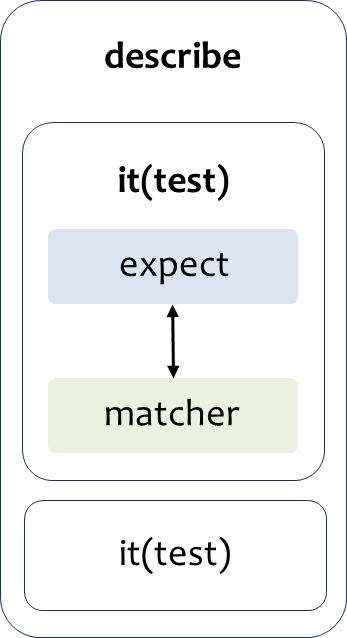

## TDD란 무엇인가?


- 테스트 주도 개발 (Test Driven Development)
- 실제 코드를 작성하기 전 테스트 코드를 작성한 후 그 테스트 코드를 통과할 수 있는 실제 코드를 작성한다.

```
1️⃣ 원하고자 하는 기능의 테스트 코드를 작성한다.
2️⃣ 테스트 실행 ❌ FAIL
3️⃣ 테스트 코드에 맞는 실제 코드를 작성한다.
4️⃣ 테스트 실행 ⭕ PASS
```

### TDD를 하면 좋은 점

- 많은 기능을 테스트할 수 있어 소스 코드에 안정감이 부여된다.
- 실제 개발 시 많은 시간이 소요되는 디버깅 부분을 단축하고 이를 통해 실제 개발 시간도 줄일 수 있다.
- 소스 코드를 더욱 신중하게 짤 수 있어 깨끗한 코드를 작성할 확률이 높아진다.

<hr/>

## React Testing Library


### RTL이란?

- 리액트 컴포넌트를 테스트하는 가벼운 방법이다.
- CRA로 리액트 앱 생성 시 기본적으로 지원되는 테스팅 도구이다.
  - 아닐 경우 직접 npm으로 추가할 수 있다.
    ```
    npm install --save-dev @testing-library/react
    ```
- React 구성 요소 작업을 위한 API를 추가해 DOM Testing Library 위에 구축된다.
  - DOM Testing Library: DOM 노드 테스트를 위한 가벼운 솔류션

### Enzyme과의 차이점

- RTL은 Enzyme(에어비앤비)을 대체하는 테스트 솔루션이다.

> Enzyme

- 구현 주도 테스트 (Implementation Driven Test)
- 컴포넌트의 세부 정보를 테스트한다.
- 예
  - props가 어떤 식으로 교환되는지, state가 어떤 식으로 흘러가는지 등의 구현
  - p 태그로 구현된 UI를 h2 태그로 바꾸면 에러가 발생한다.

> RTL

- 행위 주도 테스트 (Behavior Driven Test)
- 개발자를 React 애플리케이션의 사용자 입장에 두고 테스트한다.
- 예
  - 어떤 기능이 있고 그 기능이 잘 동작하는지
  - 태그가 바뀌어도 사용자 입장에서는 어떤 태그로 글을 표현하는지 보다 어떤 이벤트가 발생하면 화면이 어떻게 변화하는지가 더 중요하므로 에러가 바생하지 않는다.

### RTL 주요 API

- <code>App.test.js</code>: 기본 테스트가 진행되는 곳

  ```js
  import { render, screen } from "@testing-library/react";
  import App from "./App";

  test("renders learn react link", () => {
    // render 함수로 미리 컴포넌트를 렌더링함
    render(<App />);
    // 렌더링 된 컴포넌트에서  'learn react'라는 텍스트가 컴포넌트 안에 들어가 있는지 확인하기
    const linkElement = screen.getByText(/learn react/i);
    // expect + matcher를 사용
    expect(linkElement).toBeInTheDocument();
  });
  ```

> render 함수

- DOM에서 컴포넌트를 렌더링하는 함수
- 인자로 렌더링할 React 컴포넌트가 들어간다.

```js
test("renders learn react link", () => {
  const { getByText } = render(<App />);
  const linkElement = getByText(/learn react/i);
  expect(linkElement).toBeInTheDocument();
});
```

- 위처럼 구조분해할당으로 return을 통해 원하는 쿼리 함수만 얻어올 수도 있다.
  - 이는 **소스 코드가 복잡해지면 비추천** 되는 방식이다.
  - 사용해야 할 쿼리가 많아질 수록 코드가 복잡해질 수 있기 때문이다.
  - **_screen 객체_**를 사용하자!

### 쿼리 함수

- 페이지에서 요소를 찾기 위해 RTL이 제공하는 방법
- get, find, query 등 여러 유형이 존재한다.
  - 요소가 발견되지 않을 때 쿼리에서 오류가 발생하는지 / promise를 반환하고 다시 시도하는지 등의 차이가 있다.

> <code>getBy...</code>

- 쿼리에 대해 일치하는 노드를 반환한다.
- 일치하는 요소가 없거나 일치하는 요소가 두 개 이상 발견되면 **오류를 발생**시킨다.
- 따라서, 둘 이상의 요소가 예상되는 경우 <code>getAllBy...</code>를 사용하자!

> <code>queryBy...</code>

- 쿼리에 대해 일치하는 노드를 반환한다.
- 일치하는 요소가 없으면 **null을 반환**한다.
  - 존재하는 요소를 확인할 때 유용하다.
- 둘 이상의 일치하는 항목이 발견될 경우 **오류가 발생**한다.
  ➡️ 대신 <code>getAllBy...</code>를 사용하자!

> <code>findBy...</code>

- 주어진 쿼리와 일치하는 요소가 발견될 경우 **Promise를 반환**한다.
- <code>getBy</code> + <code>waitFor</code>
  - <code>waitFor</code>: 일정 기간 동안 기다려야 할 때 사용하여 통과할 때까지 기다리게 만들 수 있다.
- 요소가 발견되지 않거나 기본 제한 시간(1000ms)이 지난 후 둘 이상의 요소가 발견되면 **오류가 발생**한다.
- 둘 이상의 요소를 찾아야 하는 경우 <code>findAllBy...</code>를 사용하자!

<hr/>

## Jest


### Jest란?

- 페이스북에 의해 만들어진 테스팅 프레임 워크
- 최소한의 설정을 기반으로 동작하면서 만들어진 테스트 케이스로 어플리케이션의 코드가 잘 작동하는지 확인한다.
- 단위 테스트를 위해서 이용한다.

### Jest 시작하기

- RTL처럼 미리 설치되어 있어 보통 직접 설치해 줄 필요는 없다.
- 만약 직접 시작하려면 아래와 같이 할 수 있다.

#### 1️⃣ Jest 라이브러리 설치하기

```
npm install jest --save-dev
```

#### 2️⃣ Test 스크립트 변경하기

```json
"test" : "jest" or "jest-watchAll"
```

#### 3️⃣ 테스트 작성할 폴더 및 파일 기본 구조를 생성하기

```
test
ㄴ integration (통합 테스트 폴더)
    ㄴ products.int.test.js (대상이름.test.init.js)
ㄴ unit (단위 테스트 폴더)
    ㄴ products.test.js (대상이름.test.js)
```

> Jest가 Test 파일을 찾는 법

- <code>{filename}.test.js</code>
- <code>{filename}.spec.js</code>
- 'tests' 폴더 내부의 모든 파일

위에 해당하는 파일을 찾는다.

### Jest 파일 구조 및 사용법



> describe

- <code>argument(name, fn)</code>
- 여러 관련 테스트들을 그룹화하는 블록을 생성한다.

> it (= test)

- <code>argument(name, fn, timeout)</code>
- 개별 테스트를 수행하는 곳
- 각 테스트를 작은 문장처럼 설명한다.

> expect

- 값을 테스트 할 때마다 사용되는 함수
- 단독으로 사용되기 보다는 주로 matcher와 함께 사용된다.

> matcher

- 다른 방법으로 값을 테스트할 수 있도록 한다.

```js
test("plus calc", () => {
  expect(1 + 2).toBe(3); // 여기서 toBe(4)가 matcher에 해당한다.
});
test("plus calc", () => {
  expect(1 + 2).not.toBe(4);
});

// 둘 다 PASS
```
